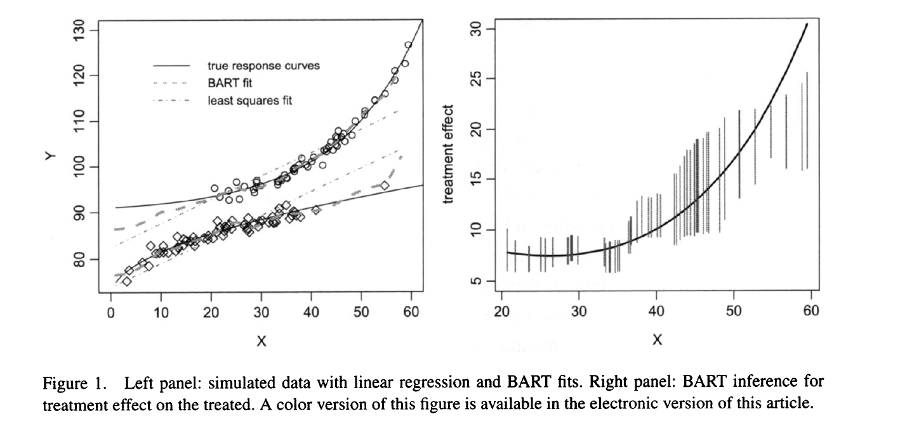
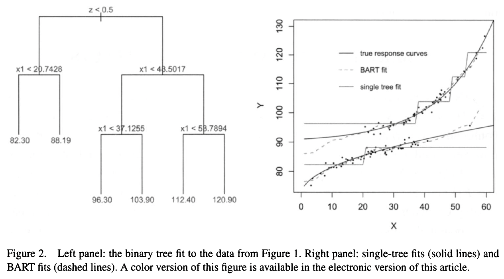

# Summary

Bayesian additive regression tree[@hill2011bayesian] (BART) concept. So please read [BART note](BART.qmd) first.

It's a flexible modeling scheme to identify causal effects of treatment in nonexperimental setting. 

# Notes

$$ Y = f(z,x) + \epsilon$$

- Flexible Bayesian non-parametric modeling procedure

Advantages:

- requires less guess work in model fitting
- handles a large number of predictors
- yields coherent uncertainty intervals
- fluidly handles continuous treatment variables and missing data for the outcome variable.
- naturally identifies heterogeneous treatment effects 
- produces more accurate estimates of average treatment effects compared to propensity score matching, propensity-weighted estimators, and regression adjustment in the nonlinear setting. 

# Introduction

Identifying causal inference in observational data usually requires 2 modeling:

1. treatment assignment mechanism
2. outcome (or potential outcome) conditional on the treatment and confounding covariates (a.k.a. response surface)

BART uses Bayesian nonaprametric modeling approach to precisely model the response surface.

-	Easy to implement
-	More accurate than frequentist linear regression with IPW or PS matching when the truth is non-linear
-	Only need to fit the outcome model (not a separate model for IPW). 
    - Outcome model = response surface
-	Input outcome, treatment assignment, and confounding covariates into the software and it runs MCMC and estimates the parameter values
-	No need to know how these variables are related myself (because it is non-parametric)
-	Detect interactions & non-linearities in the response surface 
    - Can readily identify heterogeneous treatment effects
-	Produces coherent posterior intervals

# Causal Inference 

- In observational studies, potential outcomes are typically NOT independent of treatment assignment. 

- $Z=\{0,1\}$ = binary treatment variable
- $Y_i(1)$ = potential outcome of individual $i$ when $Z=1$
- $Y_i(0)$ = potential outcome of individual $i$ when $Z=0$
- $Y_i = Y_i(1) Z_i + Y_i(0)(1-Z_i)$ = observed outcome of individual $i$
- $X$ = a vector of pretreamtent variables or "confounding" covariates.
- Sample average treatment effect (SATE):
$$\sum_{i=1}^{n} (Y_i(1) - Y_i(0))$$
- Sample average treatment effect on the treated (SATT):
$$\sum_{i: Z_i = 1} (Y_i(1) - Y_i(0))$$
- Population average treatment effect (PATE):
$$E[Y(1) - Y(0)]$$
- Population average treatment effect in the treated (PATT):
$$E[Y(1) - Y(0) \mid Z=1]$$
- Conditional average treatment effect (CATE):
$$\sum_{i=1}^{n} E(Y_i(1) - Y_i(0) \mid X_i)$$
- Conditional average treatment effect on the treated (CATT):
$$\sum_{i: Z_i = 1} E(Y_i(1) - Y_i(0) \mid X_i)$$

How do we estimate the conditional expectations? 

Suppose we have one covariate. look at the figure below. 

- BART is able to estimate the conditional expectation (left panel), from which we can estimate treatment effect on the treated people (right panel).
- BART can provide 95% credible interval for each X value from a treated observation
- Uncertainty bounds grow much wider in the range where there is no overlap across treatment groups. 

What if :

1. we have large number of confounding variables or 
2. we are uncertain about which predictors are needed to satisfy ignorability? 

Many methods suggests using treatment assignment mechanism AND modeling the response surface. 
  
  - properly specifying the assignment mechanism => no need to model the response surface (just as in a randomized experiment)
  - properly specifying the response surface => no need to model the assignment mechanism (just as in a randomized experiment)

BART just focuses on **precise estimation of the response surface**, using **nonparametric** or **semiparametric** versions.

# BART and estimating causal effects 

BART is designed to estimate a model for the outcome ($Y$) (response surface) specified very generally as 

$$ Y = f(z,x) + \epsilon, \qquad \epsilon \sim N(0, \sigma^2)$$
where:

- $z$ = assigned treatment
- $x$ = observed confounding covariates 

When ignorability holds: $Y(0), Y(1) \perp Z \mid X=x$,

$$E[Y(0) \mid X=x] = E[Y \mid Z=0,  X=x] = f(0,x)$$
and

$$E[Y(1) \mid X=x] = E[Y \mid Z=1,  X=x] = f(1,x).$$

## Overview of BART

BART built on tree models.

Notations:

- $T$ = a binary tree (consists of the tree structure and all the decision rules leading down to a bottom node)
- $\mu_j$ = mean response of the subgroup of observations that fall in the $j^{th}$ bottom node.
- $M = \{\mu_1, \mu_2, \cdots, \mu_b\}$ = set of mean responses for all the bottom nodes in a tree. $b$ represents the number of bottom node.
- decision rule: as shown in Figure 2. The criteria for sending an observation with $(z,x)$ left or right at each node. For example, the first decision rule is $z<0.5$. Since $z$ is encoded as a 0-1 indicator variable, the first decision rule sends all the untreated to the left. If for the given pair $(z,x)$, if $z=0$, then the second decision rule is $x1<20.7428$. 
- $(T, M)$ = a regression tree model. For example, the tree in Figure 2 shows a single tree model  $(T_1, M_1)$
- $g(z, x; T, M)$ = the function that maps a given pair of $(z,x)$ to the mean response $\mu_j$ of the bottom node that $(z,x)$ falls into. For example, in Figure 2, if $z=0$ and $x1=10$, then $g(0, 10; T_1, M_1) = \mu_1 = 82.30$.

BART is a sum of piecewise constant binary regression trees (and a regularization parameter). The response surface can be modeled as:

$$Y = g(z, x; T_1, M_1) + g(z, x; T_2, M_2) + \cdots + g(z, x; T_m, M_m) + \epsilon = \sum_{j=1}^m g(z, x; T_j, M_j)  + \epsilon = f(z,x) + \epsilon$$
where $(T_j, M_j)$ denotes a single subtree model and $\epsilon \sim N(0, \sigma^2).$

Why sum of trees?

- one tree => overfitting
- sum of trees => regularization (each tree is a weak learner)
  - regularization prior holds back the fit of each $(T_j, M_j)$ tree allowing to contribute only a small part to the overall fit.
- sum of trees can capture more complex relationships (nonliear and interaction) between the predictors and the outcome.

The response surface is estimated with Monte carlo Markov chain (MCMC) algorithm.
At each MCMC iteration, all of the $(T_j, M_j)$ and $\sigma$ are redrawn. Only $\sigma$ is identified. Individual $(T_j, M_j)$ are not identified because they are weak learners. But the sum of trees, $f(z,x) = \sum_{j=1}^m g(z, x; T_j, M_j)$, is identified.

Prior has 3 components:

1. prior preference for trees $T_j$ with only a few bottom nodes 
2. prior which shrinks each $M_j$ towards zero (the response is centered so that zero is the typical value)
3. Prior which suggest that $\sigma$ is smaller than that given by least squares, but not dramatically so. 

If the data strongly suggests that larger trees are needed, the prior may be overcome.

Convergence: 
- check the trace plot of $\sigma$. The MCMC search through the space of $f$, so $f$ is always better convergence metric than $\sigma$. Once the draw of $\sigma$ is stabilized, it represents the natural Bayesian quantification of the posterior uncertainty. 

## Advantages of BART for causal inference

- practical & easier to use: default prior is highly competitive in terms of prediction with other methods that rely on cross-validation to tune algorithm parameters. 
- Uncertainty quantification: free because it's a Bayesian method
- capture nonlinearities and interactions: without specifying them in advance.
  - Nonlinearity: Each $T_j$ uses only one component of $(z,x)$ in all of the interior decision nodes. => overall fit like generalized additive model. => combine the contributions of many threes (all using only a common variable) => nonlinear $f(z_i, x_i)$ can be approximated. 
  - Interactions: a $T_j$ involves more than one component of $(z,x)$ in its decision rules. 
- Stable: converges well
- handle large number of predictors: the variable is not useful? => don't use the variable. 
- Less guesswork for modeling scheme: no need to specify the functional form of the response surface. 

## Estimating Causal Effects 

- Average causal effects (ATE) can be estimated
- In theory, individual-level causal effects could be estimated as well but these would likely be far less robust. 

The nature of algorithm conditions on the $X$ values in the sample $\rightarrow$ a natural set of estimands are the conditional average treatment effect (CATE) & conditional average treatment effect on the treated (CATT).

CATE: 

$$\frac{1}{n} \sum_{i=1}^{n} E(Y_i(1) \mid X_i) - E(Y_i(0) \mid X_i) =\frac{1}{n} \sum_{i=1}^{n}f(1, x_i) - f(0,x_i)$$

CATT:
$$\frac{1}{n} \sum_{i:Z_i=1} E(Y_i(1) \mid X_i) - E(Y_i(0) \mid X_i) =\frac{1}{n} \sum_{i:Z_i=1} f(1, x_i) - f(0,x_i)$$

## BART and Missing Outcome data

fit BART on a complete case and make predictions for the missing outcome data. The predictions are based on the observed covariates and treatment assignment. The uncertainty in the predictions is naturally captured by the posterior distribution of the BART model.

## References
