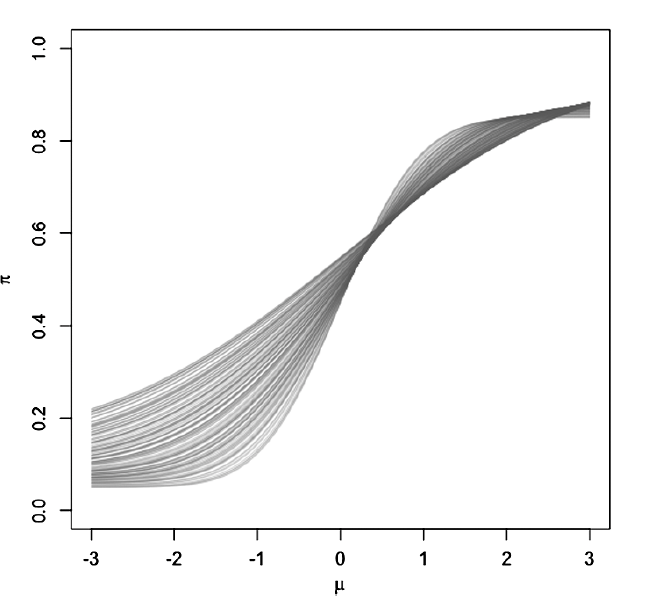

# Summary


Bayesian Causal Forest[@hahn2020bayesian] (BCF) is a modeling scheme to identify heterogeneous treatment effects. It is specifically useful with small effect size and strong confounding. That is, where the conditional expectation of outcome is largely determined by confounders rather than the treatment.

It is an extension of BART, which is a flexible modeling scheme to identify conditional causal effects of treatment in nonexperimental setting.

It especially controls the strength of regularization over effect heterogeneity and the confounding bias (separately), which is important when the effect size is small and the confounding is strong. 


# Model setup


Let:

- $n$ : total number of independent sample
- $Y$ : a scalar response variable. Length $n$ column vectors.
- $Z$ : a binary treatment indicator variable. Length $n$ column vectors.
- $x$ : a length $d$ vector of observed control variables
- $\boldsymbol{X}$ : a $n \times d$ matrix of observed control variables
- $(Y_i, Z_i, z_i)$ : a set of all observations for $i^{th}$ sample.
- $Y_i(1)$ : a counterfactual outcome for $i^{th}$ sample if treated
- $Y_i(0)$ : a counterfactual outcome for $i^{th}$ sample if not treated
- $Y_i = Z_i Y_i(1) + (1-Z_i)Y_i(0)$ = observed outcome for $i^{th}$ sample that corresponds to the realized treatment status $Z_i$.
- $Y_i(0), Y_i(1) \perp Z_i \mid \boldsymbol{X}_i$ : strong ignoarability assumption. Assume to hold for all $i$.
- $0 <  Pr(Z_i = 1 \mid x_i)<1$ : positivity assumption, which also assumed to hold for all $i$.
- $\tau(x_i) = E[Y_i(1) - Y_i(0) | x_i] = E(Y_i \mid x_i, Z_i=1) - E(Y_i \mid x_i, Z_i=0)$ : the conditional average treatment effect (CATE) for $x_i$. 


Suppose that the distribution of counterfactual outcomes under treatment and controls are different as follows: 

$$Y_{i1} \stackrel{i.i.d}{\sim} N(\mu + \tau, \sigma^2)$$
$$Y_{i0} \stackrel{i.i.d}{\sim} N(\mu, \sigma^2)$$

That is, you are assuming that the are normally distributed with the same variance, and the two means are different by $\tau$. Then, the average treatment effect (ATE) is $\tau$.

We are interested in a scenario that these two means are similar. That is, we will be putting a prior on $\tau$ shrinking towards zero.


We use mean-zero additive error representation:

$$Y_i = f(x_i,Z_i)+ \epsilon_i = \mu(x_i, \hat{\pi}(x_i)) + \tau(x_i) z_i + \epsilon_i, \qquad \epsilon_i \sim N(0, \sigma^2)$$

where 

- $\mu(x_i, \hat{\pi}(x_i))$: the prognostic effect of covariates, 
- $\hat{\pi}(x_i)$: the estimated propensity score, which is the probability of receiving treatment given covariates $x_i$. It is used to control for regularization-induced confounding[@hahn2018regularization] due to target selection.
- $\tau(x_i)$: the treatment effect heterogeneity, and 
- $\epsilon_i$: the error term.


## Regularization-induced Confounding

What is this regularization-induced confounding due to target selection?


Targeted selection is where the probability of treatment increases (or decreases) in the expected outcome under no treatment. 

For example, doctors treat patients who they think need it. That is, doctors are more likely to assign treatment to patients with worse expected outcomes in its absence (see @fig-figure1). So the probability of receiving treatment is approximately monotone in the expected outcome under no treatment. i.e., for every fixed value $\tilde{x}$,  $E(Z \mid x) = \pi(\mu, \tilde{x})$, where $\mu = \mu(\tilde{x}) = E[Y(0) \mid x = \tilde{x}].$

{#fig-figure1}


Why can this become a problem? Consider, a scenario where we have the following conditions: 

1. finite sample,
2. lots of covariates,
3. next to no treatment effect,
4. $\mu(\tilde{x})$ is complex, and
5. $\pi(\mu, \tilde{x})$ looks like $\mu(\tilde{x})$ (Under targeted selection, this happens. Nearly monotonically related).


In finite samples, outcome models must be regularized. If $\mu(x)$ is complex relative to the model class/prior (e.g., hard to represent with shallow trees), the fitted model may underfit $\mu(x)$. Under strong confounding, $Z$ is correlated with the prognostic direction, so using $Z$ (e.g., splitting on $Z$ in a tree model) can provide a cheap way to capture variation that should be attributed to $\mu(x)$. Regularization can therefore favor response-surface representations that attribute prognostic structure to treatment, yielding biased estimates of $\tau(x)$ even when true effects are small (regularization-induced confounding). Including $\hat{\pi}(x)$ as a covariate reduces this risk by giving the model an explicit, low-dimensional representation of the confounding/prognostic direction that competes with $Z$ under the same regularization. 


When implementing using `bcf` package in R, the propensity score has to be estimated separately and estimated to use as an input. 


The authors of bcf paper recommends including an estimated propensity score as a covariate as routine practice when using using BART.


# Prior 

Recall our model:

$$Y_i = \mu(x_i, \hat{\pi}(x_i)) + \tau(x_i) z_i + \epsilon_i, \qquad \epsilon_i \sim N(0, \sigma^2),$$
where $\hat{\pi}(x)$ is an estimated propensity score included as an input. The priors on $\mu$ and $\tau$ are independent, and $\hat{\pi}(x)$ is treated as a fixed transformation of $(X,Z)$.


Notation:

- $T_l$: a binary tree (consists of the tree structure and all the decision rules leading down to a bottom node), where $1 \leq l \leq L$.
- $m_{lb}$: mean response of the subgroup of observations that fall in the $b^{th}$ terminal node (or a leaf) in the $l^{th}$ tree.
- $\{\mathcal{A}_{1}, \cdots, \mathcal{A}_{B(l)}\}$: a set of $B$ terminal node regions (leaves) in the induced partition of covariate space of the $l^{th}$ tree. For example, in @fig-figure2 left panel, there are three terminal nodes in total, i.e., $B=3$. The two decision nodes are: split on $x_1$, then the split on $x_2$.   The first decision node is $x_1<0.8$, and the second decision node is $x_2<0.4$. Here, $\mathcal{A}_{1} = \{(x_1,x_2) \mid x_1 \geq 0.8 \}$, $\mathcal{A}_{2} = \{(x_1,x_2) \mid x_1 < 0.8,  x_2 \geq 0.4\}$, and $\mathcal{A}_{3} = \{(x_1,x_2) \mid x_1 < 0.8,  x_2 < 0.4\}$.
- $g_l(x)$ = a piecewise constant function formed by the partition and leaf parameters of $l^{th}$ tree. This function maps $x$ to $m_{lb}$ if $x \in \mathcal{A}_{b}$. 


{#fig-figure2}


For both $\mu$ and $\tau$, we will put priors on the tree structure and the leaf parameters. The tree structure is basically determining how large and deep each tree is, and the leaf parameters is terminal node mean. 

The priors on the tree structure and leaf parameters are independent across trees.

The model for prior on a single tree structure is suggested in Chipman et al. (1998)[@chipman1998bayesian]: the probability that a node at depth $h$ splits

$$\eta(1+h)^{-\beta}, \qquad \eta \in (0,1), \; \beta \in [0, \infty).$$

where 

- $\eta$ controls the overall probability of splitting, and
- $\beta$ controls the depth of the tree. Larger $\beta$ means more penalty on deeper trees, and thus favors shallower trees.


## Prior on $\mu$

Prior on $\mu$ is a default BART[@hill2011bayesian] prior, with a variance prior tweak. (Why? Really good predictive performance. BART is particularly well-suited to detecting interactions and discontinuities, can be made invariant to monotone transformations of the covariates, and typically requires little parameter tuning. )


As in BART, individual regression tree are additively combined into a single regression *forest*: 

$$f(x) = \sum_{l=1}^{L} g_l(x)$$


- tree structure:
  - Large, deep trees are given extremely low prior probability: 200 trees, $\beta=2$, $eta=0.95$ [@chipman2010bart]
- The leaf parameters $m_{lb}$: half-Cauchy prior with prior median equal to twice the marginal standard deviation of $Y$. 


## Prior on $\tau$

Stronger regularization than $\mu$, to keep skepticism about complex heterogeneity:

- tree structure:
    - 50 trees (fewer than $\mu$'s 200)
    - depth penalty $\beta = 3$, split probability $\eta = 0.25$ (much shorter shrinkage)
- Leaf scale prior: half-normal prior with prior median pegged to the marginal SD of $Y$ (as a "reasonable upper bound" absent strong prior info)


Conceptually: “no splitting” in $\tau$ corresponds to purely homogeneous treatment effects; the prior puts meaningful mass near that regime.


## changing defaul prior values 


The default values are provided in the `bcf` package. Of course, I can change them as I would like. For example, the default prior for $\tau$ is intentionally skeptical and operationalizes that by penalizing depth more strongly, lowering split probability, and using relatively few trees (50). If I have reason to believe that there is more heterogeneity, I can relax these parameters. For example, I can set $\beta=2$ and $\eta=0.95$ for $\tau$ as well, which is the same as $\mu$.


# Coding sensitivity

The following model 

$$f(x_i, z_i) = \mu(x_i, \hat{\pi}) + \tau(x_i) z_i$$

is **not** invariant to coding of $Z$. That is, if we code $Z$ as 0/1, the resulting posterior distribution of $\tau(x)$ may be different if we code $Z$ as $\pm -1/2$. 

This is due to the fact that  $\mu$ and $\tau$ alias one another under
*targeted selection*. The choice of treatment coding can meaningfully impact posterior
inferences, especially when the treated and control response variables have dramatically
different marginal variances.


Invariant paramterization is possible, which treats the coding of $Z$ as a paramter to be estimated:

$$y_i = \mu(x_i) + \tilde{\tau}(x_i) b_{z_i} + \epsilon_i, \qquad \epsilon_i \sim N(0, \sigma^2),$$
$$b_0 \sim N(0, 1/2), \qquad b_1 \sim N(0, 1/2).$$

The treatment effect function in this parameter expanded model is 

$$\tau(x_o) = (b_1 - b_0)\tilde{\tau}(x_i).$$
Nothing that $b_1 - b_0 \sim N(0,1)$ we still obtain a half normal prior distribution for the scale of the leaf parameters in $\tau$ as in the previous subsection, and we can adjust the scale of the half normal prior (e.g. to fix the scale at one marginal standard deviation
of Y as above) using a fixed scale in the leaf prior for $\tilde{\tau}$.

Posterior inference with this model requires Bayesian backfitting MCMC algorithm. This is the default implementation in the `bcf` software package. 

# Example for TRIUMP trial

<!-- I'm helping with Nikki doing analysis exploring the treatment effect of intensive intervention of exercise on cognitive function in patients with resistant hypertension.  -->


The treatment effect of C-LIFE vs. SEPA on cognitive function in patients with resistant hypertension will be assessed using Bayesian Causal Forest[@hahn2020bayesian] (BCF). BCF is a flexible Bayesian nonparametric regression model for estimating average and heterogeneous treatment effects. It is set up to easily identify heterogeneous treatment effects as well. Its strength is well observed especially under small sample size, small effect size, strong confounding, and for observational studies. We use `bcf` package in R to fit the model. 

<!-- In Hill (2011)[@hill2011bayesian], it recommends to remove the observations with missing outcome variables and just predict after fitting model on the complete cases. So currently, we have 10 patients with missing outcomes, which we will remove. However, each of the four out of these ten patients are missing one other variable such as: Flow mediated dilation of the brachial artery at baseline, memory at baseline, and Baseline DASH diet score. So if any of these variables end up in the final model, we won't be able to estimate the outcome for these patients. -->

<!-- In addition, 22 patients were removed from the data due to missing at least one covariate, leaving 108 patients for model fitting. -->

Let's fix executive function as our primary outcome and provide the mathematical steps to analyzing the data. 

- $Y_i$: executive function (continuous)
- $Z_i$: binary treatment indicator.  1=C-LIFE (treated), 0= SEPA.
- $X_i$: a vector length 32, of covariates. 


$$y_i = \mu(x_i) + \tau(x_i) z_i + \epsilon_i, \qquad \epsilon_i \sim N(0,\sigma^2). \qquad(1)$$
where 

- $\mu(x_i)$: the prognostic effect of covariates, 
- $\tau(x_i)$: the treatment effect heterogeneity, and 
- $\epsilon_i$: the error term.


BCF is often written as $y_i = \mu(x_i, \hat{\pi}(x_i)) + \tau(x_i) z_i + \epsilon_i$, where $\hat{\pi}(x_i)$ is an estimate of the propensity score. Including $\hat{pi}$ is not required for consistency, but can reduce finite sample bias from regularization-induced confounding under targeted selection. In TRIUMP, treatment was assigned by 2:1 randomization, so $\pi_i=2/3$ for all subjects (or known by design). Because this is constant, including $\pi_i$ does not affect model fitting and thus, we removed it from the equation above for simplicity. 


We decompose the conditional mean response surface into two components:  $\mu(x_i)$, a flexible prognostic (baseline) function capturing variation in outcomes under control, and $\tau(x_i)$, the treatment effect function capturing effect heterogeneity. Under 0/1 coding, 
$\mu(x)=E(Y∣Z=0,X=x)$ and $\tau(x)=E(Y∣Z=1,X=x)−E(Y∣Z=0,X=x)$. For interpretability, we describe the model in this 0/1-coded form, but the inference is obtained using the coding-invariant parameter-expanded implementation, which yields the same estimand $\tau(x)$


The prognostic effect $\mu$ and treatment effect heterogeneity $\tau$ are modeled independently. Each is modeled as a sum of regression trees, with independent priors on the tree structure and leaf parameters. The model for prior on a single tree structure is suggested in Chipman et al. (1998)[@chipman1998bayesian]: the probability that a node at depth $h$ splits

$$Pr(\text{split at depth } h) =  \eta(1+h)^{-\beta}, \qquad \eta \in (0,1), \; \beta \in [0, \infty),$$

where 

- $\eta$ controls the overall probability of splitting, and
- $\beta$ controls the depth of the tree. Larger $\beta$ means more penalty on deeper trees, and thus favors shallower trees.

We will use the default prior values provided in the `bcf` package for modeling $\mu$. The default setup has been shown to perform quite well under a wide range of data generating processes. We will fit 200 trees, and set $\beta=2$ and $\eta=0.95$[@chipman2010bart]. The leaf parameters, which are means of each terminal node, will be modeled using normal distribution with mean 0 and variance $\sigma_m^2$, where $\sigma_m$ will be modeled with half-Cauchy prior. The half-Cauchy prior will be parameterized such that the median is equal to twice the marginal standard deviation of $Y$. The marginal standard deviation of $Y$ will be estimated with sample standard deviation. 

For modeling $\tau$, we will explore a number of different choices. The default prior for $\tau$ is intentionally skeptical and operationalizes that by penalizing depth more strongly, lowering split probability, and using relatively few trees (approximately 50 trees). We do not have any belief that there is small heterogeneity nor strong confounding effect. Thus, we will use two different prior distributions:

1. Primary analysis: default prior
    - tree structure:
        - 50 trees (fewer than $\mu$'s 200)
        - depth penalty $\beta = 3$, 
        - split probability $\eta = 0.25$ (much shorter shrinkage)
    - Leaf scale prior: half-normal prior with prior median pegged to the marginal SD of $Y$ (as a "reasonable upper bound" absent strong prior info)
2. Sensitivity analysis: same prior as $\mu$ (i.e., $\beta=2$ and $\eta=0.95$ for $\tau$ as well). We will also use the half-Cauchy scale prior calibration as $\mu$.


BCF uses the same backbone as BART—Bayesian backfitting MCMC (sequentially updating trees conditional on partial residuals). That is, since $\mu$ and $\tau$ are sums of trees, one tree is updated at a time conditional on partial residuals. 


Please note that Equation (1) is not invariant to coding values of $Z$ for posterior distribution of $\tau$. Thus, the authors have provided invariant modeling scheme which corrects this, and it is the default method implemented in the `bcf` package in R. We did not find it necessary to discuss this detail. Please refer to Hahn et. al. (2020)[@hahn2020bayesian] for more detail. 

To explore potential effect-modifying subgroups, we will fit a parsimonious regression tree (CART[@breiman2017classification] via `rpart`) to posterior point estimates of unit-level treatment effects $\hat{\tau}(x_i)$, using the candidate effect modifiers as predictors. The resulting tree will be used as a posterior stigmatization tool to propose subgroups, after which subgroup ATE contrasts will be summarized using the full posterior draws from BCF. 


When reasonable number of interesting subgroups are found their posterior distribution of ATE will be plotted as below:

```{r}
#| label: fig-peng-tour-demo
#| layout-ncol: 2
#| echo: false
#| fig-cap:
#| - "Example mock plot. Posterior distribution of subgroup treatment effect on men age < 46 (blue) and women older than 66 (red)."
#| - "Example mock plot. Difference in posterior distribution of treatment effects between the subgroups."


#two figures side by side


library(data.table)
library(ggplot2)

set.seed(403)
x1<-rnorm(1000, mean=3, sd=1)
x2<-rnorm(1000, mean=1, sd=1)
diff_x<-x1-x2

dat<-
data.table(
  x=c(x1,x2),
  diff_x=diff_x,
  group=c(rep("x1",1000), rep("x2",1000))
)

#plot density of x1 and x2 by color
p1<-ggplot(dat, aes(x=x, fill=group)) +
  geom_density(alpha=0.5) +
  labs(title="Density of men age < 46 vs. women older than 66", 
       x="Subgroup treatment effect", 
       y="Posterior Density") +
  #Label x1 =  men age < 46 and x2 = women older than 66
       scale_fill_manual(values=c("blue", "red"), 
                         labels=c("x1" = "Men age < 46", 
                                  "x2" = "Women older than 66" )) +
  theme_minimal()

#plot difference in x1 and x2

p2<-ggplot(dat, aes(x=diff_x)) +
  geom_density(fill="grey", alpha=0.5) +
  labs(title="Posterior distribution of difference between subgroup ATEs", x="Difference", y="Density") +
  #Add dotted vertical line at x=0
  geom_vline(xintercept=0, linetype="dashed", color="grey")+
  theme_minimal()

p1
p2
```


In addition, we will report the posterior mean ATE and 95% credible interval for the overall treatment effect , and for each of the identified subgroups (mock table shown below). 


+------+------+-------+--------+
| Subgroup 1 | subgroup 2| Posterior Mean ATE (subgroup 1-2) 95% Credible Interval |
|---------|--------------------|----------------------------------------------|
| male age < 46 | women older than 66 | 0.5 (0.1, 0.9) |
+------+------+-------+--------+

We will also report the probability that the treatment effect is greater than zero for each subgroup, which can be calculated as the proportion of posterior samples where the estimated treatment effect is greater than zero.


## References
